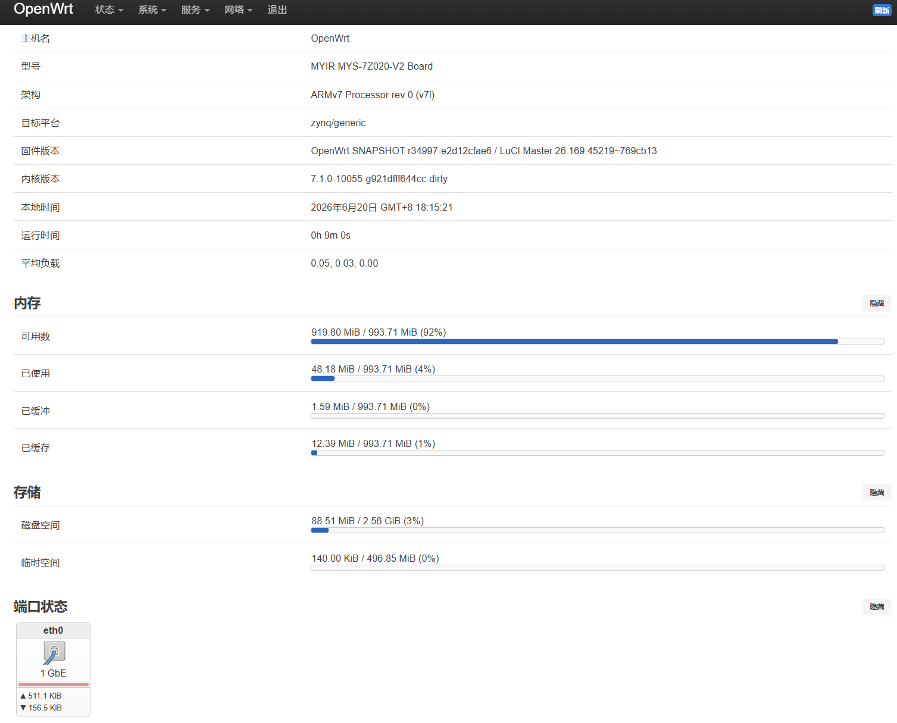

# MYS-7Z020-V2 BSP (Linux Kernel & OpenWrt RootFS)
This repository provides a complete board support package (BSP) and FPGA design for the Z-turn Board V2 (MYS-7Z020-V2-0E1D-766-C), including board-specific U-Boot, Linux kernel (v7.1.0), OpenWrt build configuration (.config), FPGA (PL) design sources, prebuilt boot images, and complete build instructions.

## Project Structure

- `kernel/`: Modified Linux kernel source code directly adapted for the Z-turn Board V2.
- `OpenWrt/`: Build configuration files for the root filesystem.
- `docs/`: Validation logs, screenshots, and hardware test results.
- `boot/`: Boot artifacts (BOOT.BIN, uEnv.txt, dtb, zImage).
- `fpga/`: Complete PL (Programmable Logic) design including RTL source code.
- `u-boot/`: Customized U-Boot source code (based on upstream u-boot-2026.07-rc4).
- `scripts/`: Automated build scripts and configuration files (e.g., boot.bif, make_boot.sh) to effortlessly package FSBL, PL bitstream, and U-Boot into BOOT.BIN.

---

## 1. Kernel Compilation

### 1.1 Initial Configuration

To apply the default configuration for the MYS-7Z020-V2 board:

```bash
make ARCH=arm CROSS_COMPILE=arm-linux-gnueabihf- mys7z020_router_defconfig
```

### 1.2 Modifying Configuration

If you need to change the kernel configuration:

```bash
make ARCH=arm CROSS_COMPILE=arm-linux-gnueabihf- menuconfig
```

Then save defconfig:

```bash
make ARCH=arm CROSS_COMPILE=arm-linux-gnueabihf- savedefconfig
cp defconfig arch/arm/configs/mys7z020_router_defconfig
```

### 1.3 Build Kernel

```bash
make ARCH=arm CROSS_COMPILE=arm-linux-gnueabihf- -j$(nproc)
```

### 1.4 Build Device Tree

```bash
make ARCH=arm CROSS_COMPILE=arm-linux-gnueabihf- xilinx/zynq-mys-7z020-v2.dtb
```

---

## 2. OpenWrt Root Filesystem Build

### 2.1 Clone Source

```bash
git clone https://git.openwrt.org/openwrt/openwrt.git
cd openwrt
./scripts/feeds update -a
./scripts/feeds install -a
```

### 2.2 Apply Configuration

```bash
cp ../mys-7z020-v2.config-openwrt .config
make defconfig
```

### 2.3 Build

```bash
make V=s -j$(nproc)
```

---

## 3. SD Card Deployment

### Partition 1: FAT32 (Boot)

Copy files:
- BOOT.BIN
- uEnv.txt
- zImage
- zynq-mys-7z020-v2.dtb

### Partition 2: EXT4 (RootFS)

Extract rootfs:

```bash
tar -xzf openwrt-zynq-generic-xlnx_zynq-xxxx-targz-rootfs.tar.gz -C /mnt/rootfs
```

---

### LuCI Dashboard Preview


---

### System Logs & Diagnostics

You can check the system boot logs and hardware test results here:
* [📄 View System Boot Log (dmesg.txt)](docs/logs/dmesg.txt)
* [🛠️ View Hardware Test Report (hardware_test.txt)](docs/logs/hardware_test.txt)

---

## License

GPLv2

